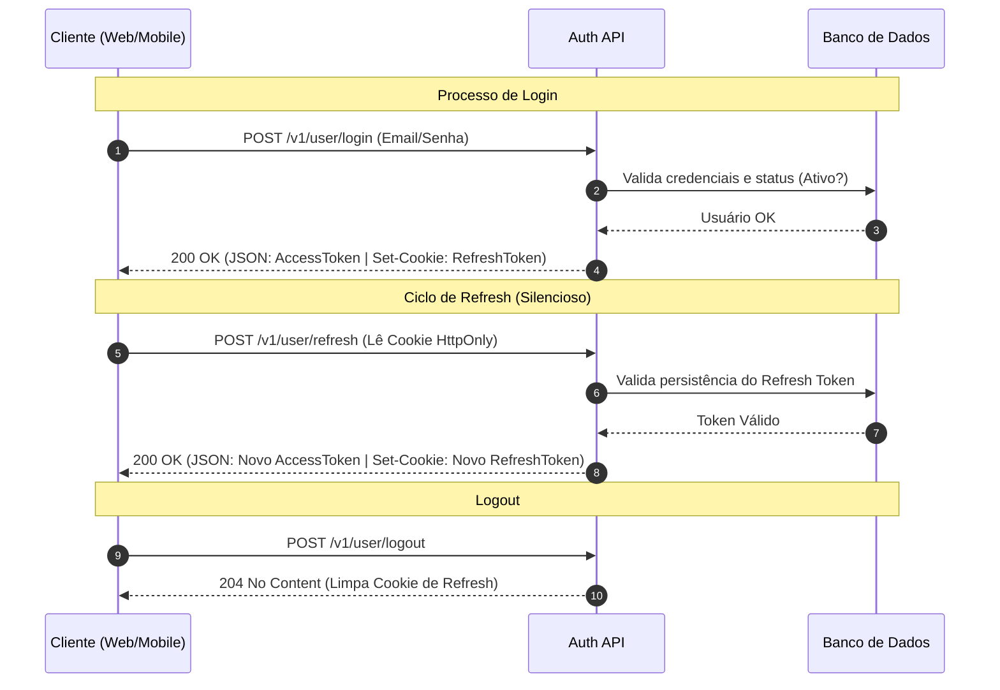
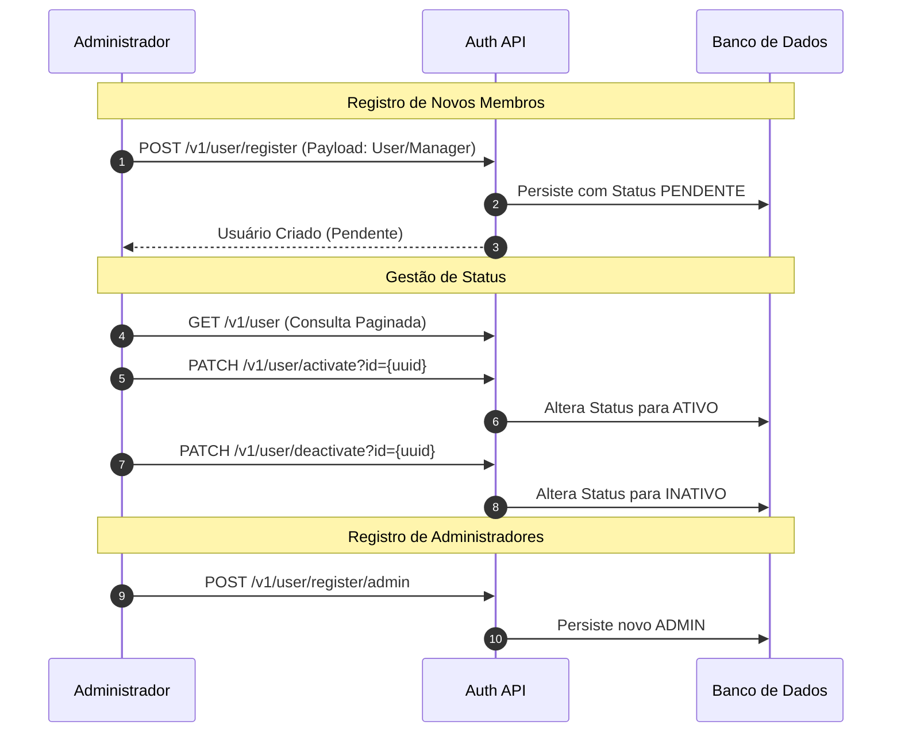
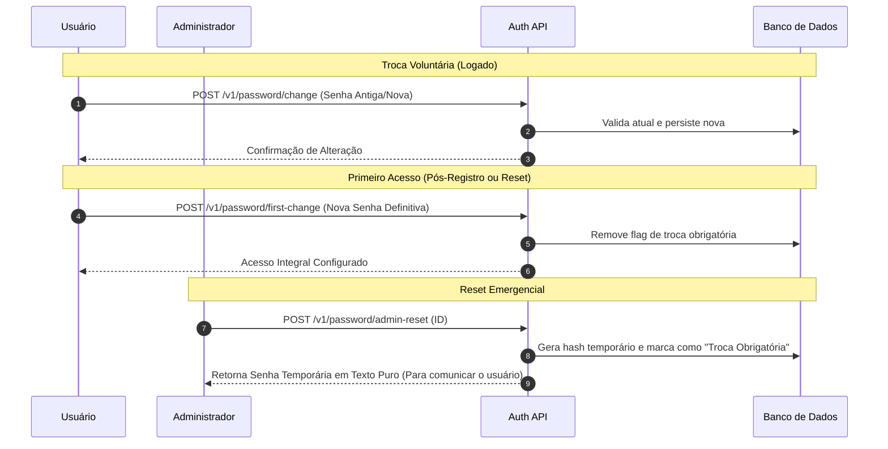
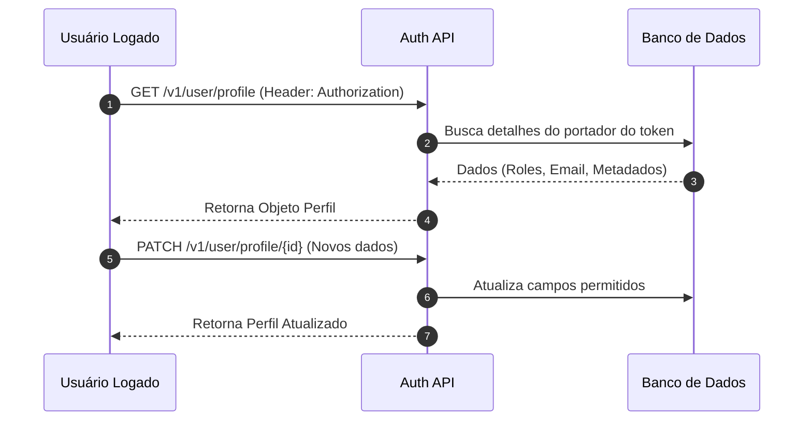
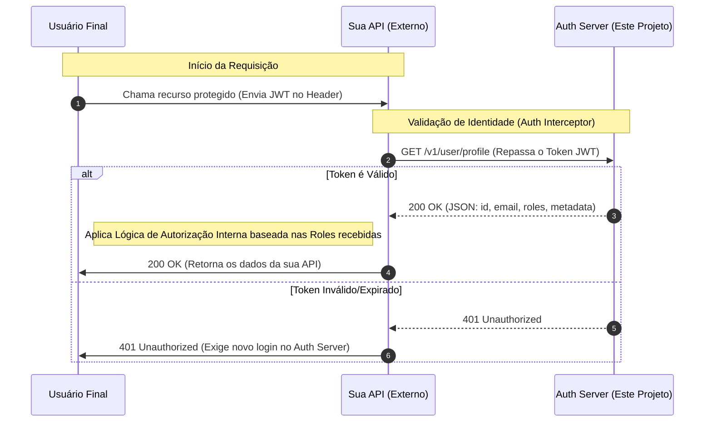

# System Auth - Spring JWT

Serviço centralizado de gestão de identidade e autenticação para ecossistemas de aplicações. Este projeto provê um Painel Administrativo para controle de ciclo de vida de usuários e uma API robusta baseada em JWT para integração com serviços externos.

---

## 🚀 Acessos Rápidos

- **Painel Administrativo (Frontend)**: `/`
- **Documentação de API (Swagger)**: `/swagger-ui.html`
- **Saúde do Sistema (Actuator Health)**: `/actuator/health`
- **Métricas do Sistema (Actuator Metrics)**: `/actuator/metrics`

---

## 🏗️ Fluxo Geral do Ecossistema

Este diagrama ilustra a relação entre o Administrador, o Usuário Final, o Auth Server e as Aplicações de Terceiros.

---

## 🔐 Módulo 1: Autenticação e Gestão de Sessão (Público)

Detalhamento técnico do processo de login, renovação via Refresh Token (Cookie HttpOnly) e encerramento de sessão.

---

## 👥 Módulo 2: Gestão de Contas e Ciclo de Vida (ADMIN)

Fluxo completo de criação e controle de privilégios executado exclusivamente por administradores.

---

## 🔑 Módulo 3: Segurança e Políticas de Senha

Processos de segurança para troca voluntária, segurança de primeiro acesso e recuperação administrativa.

---

## 👤 Módulo 4: Perfil e Dados Cadastrais (Autenticado)

Acesso a metadados do usuário logado e edição de informações de perfil.

---

## �️ Módulo 5: Painel Administrativo (Frontend)

O frontend foi desenvolvido como um SPA (Single Page Application) moderno, focado em alta performance e experiência do desenvolvedor.

### Tecnologias:

- **Vite + React + TypeScript**: Base do projeto.
- **Storybook**: Documentação dinâmica e isolada de todos os componentes de UI.
- **Vitest**: Suíte de testes unitários e de integração de componentes.

### Comandos Úteis:

Localizado no diretório `/frontend`:

- `npm run dev`: Inicia o servidor de desenvolvimento.
- `npm run build`: Gera o pacote otimizado para produção.
- **`npm run storybook`**: Abre o ambiente de documentação visual dos componentes.
- `npm run test`: Executa os testes unitários.

---

## �🔗 Guia de Integração para Outros Backends

Fluxo sugerido para aplicações externas que utilizam o Auth Server como Provedor de Identidade (IdP).

### Regras de Ouro para APIs Externas:

1. **Não armazene senhas**: Deixe que o Painel Admin deste projeto cuide de toda a gestão de segurança.
2. **Valide em cada request**: Utilize o endpoint de perfil do Auth Server como uma barreira de segurança (Introspecção de Token).
3. **Roles Dinâmicas**: Use as roles retornadas pelo Auth Server para controlar o acesso granular às suas próprias rotas.

---

## 🛡️ Mecanismo de Segurança e Tokens

O sistema utiliza uma arquitetura robusta de tokens para garantir segurança e rastreabilidade:

### 1. Dual Token (Access & Refresh)

- **Access Token (JWT)**: Vida curta (15 min), carregado no header `Authorization`. Contém as `roles` e `tokenVersion`.
- **Refresh Token (Cookie HttpOnly)**: Vida longa (7 dias), persistido no banco e enviado via cookie seguro. Utilizado apenas para renovar o Access Token sem novo login.

### 2. Versionamento e Rotação

- Cada sessão possui uma **versão**. Quando um token é renovado, a versão no banco e no próximo JWT incrementa.
- Se um token antigo for reutilizado (tentativa de roubo), o sistema detecta a divergência de versão e invalida a sessão.

### 3. Isolamento de Sessão (Fingerprinting)

As sessões são únicas por combinação de:

- **Dispositivo**: `User-Agent`.
- **Localização/Rede**: `IP Address`.
- **Origem**: `Origin` e `Referer`.

### 4. Rastreabilidade (Audit/MDC)

Cada log gerado no backend inclui:

- `requestId`: ID único para rastrear uma operação de ponta a ponta.
- `userEmail`: Identificação do usuário que realizou a ação.

---

Desenvolvido por Vinícius Gabriel Pereira Leitão.
