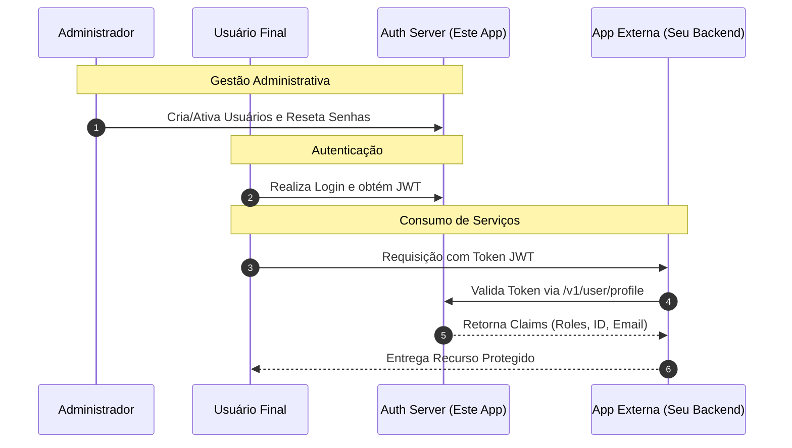
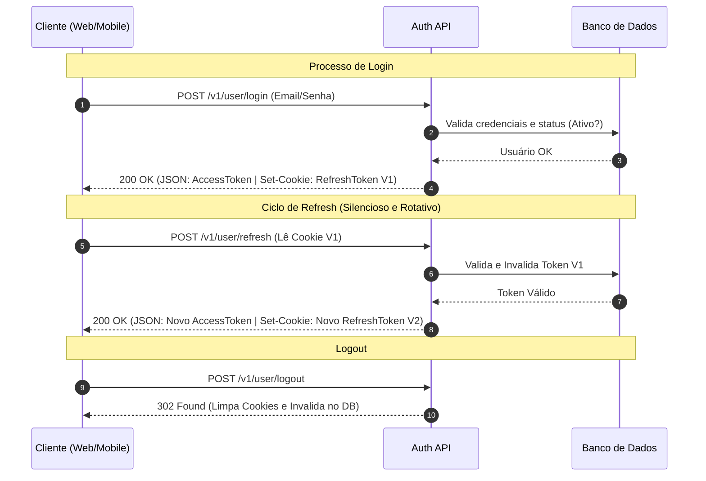
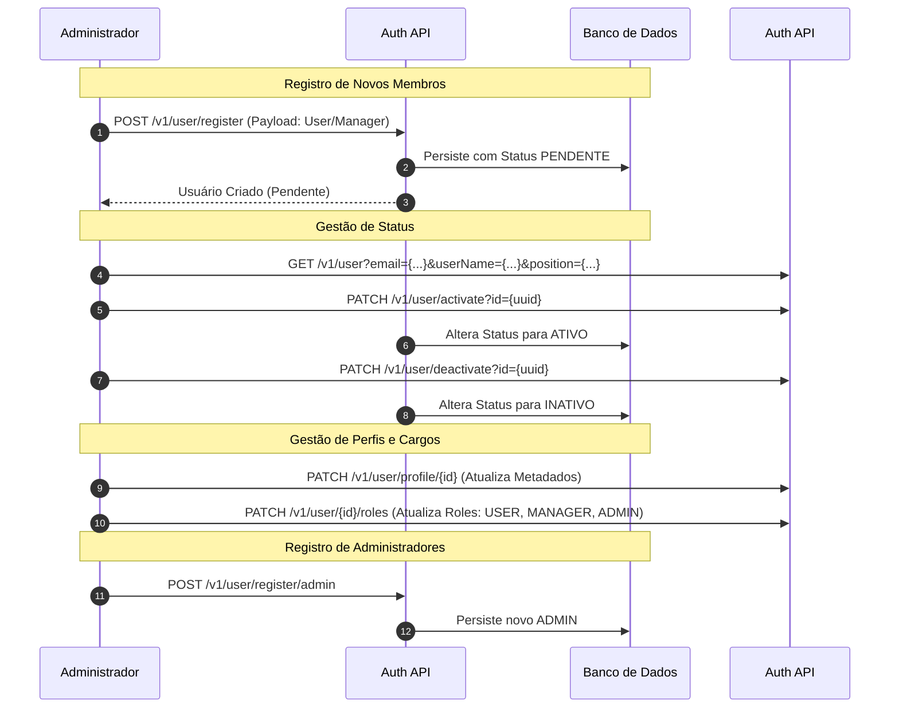
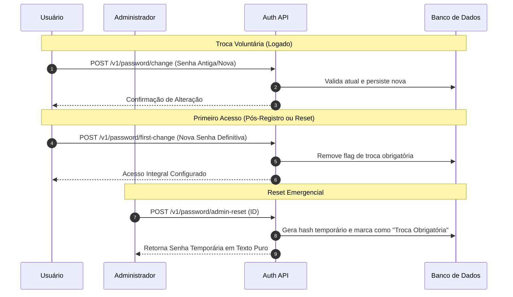
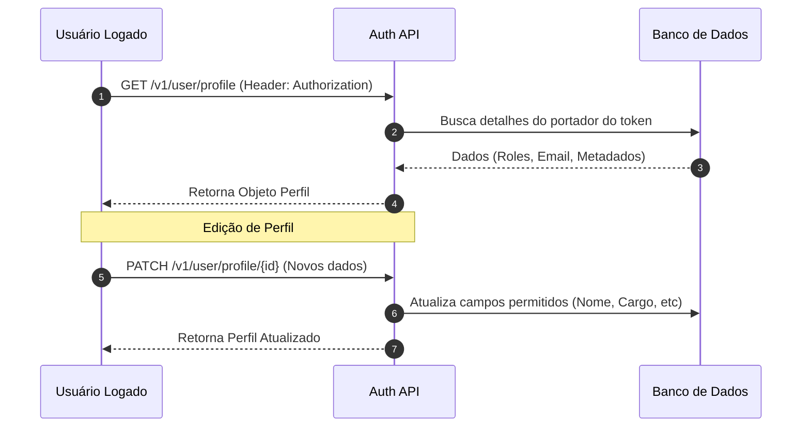
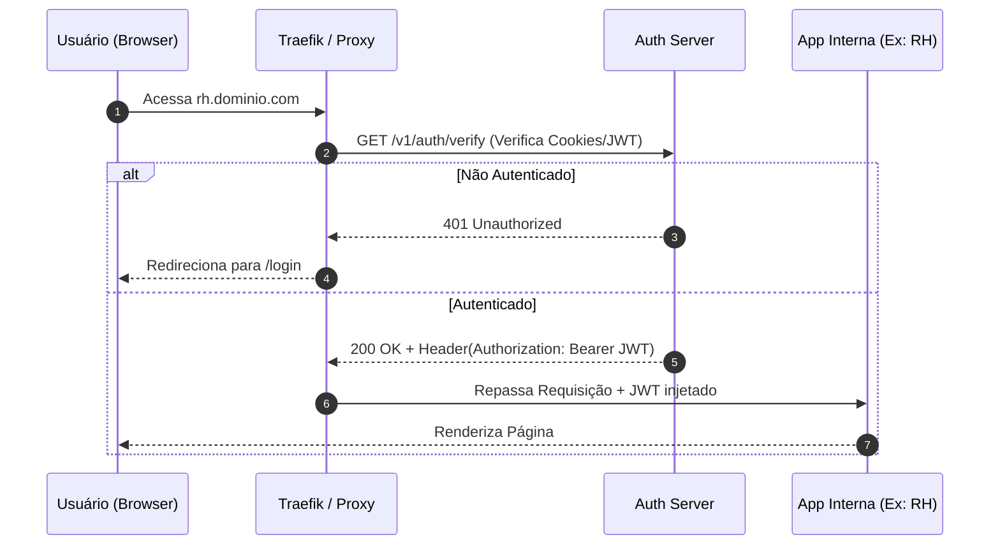

# System Auth - Spring JWT

Serviço centralizado de gestão de identidade e autenticação para ecossistemas de aplicações. Este projeto provê um Painel Administrativo para controle de ciclo de vida de usuários e uma API robusta baseada em JWT para integração com serviços externos.

---

## 🚀 Acessos Rápidos

- **Painel Administrativo (Frontend)**: `/`
- **Documentação de API (Swagger)**: `/swagger-ui.html`
- **Saúde do Sistema (Actuator Health)**: `/actuator/health`
- **Métricas do Sistema (Actuator Metrics)**: `/actuator/metrics`

---

## 🏗️ Fluxo Geral do Ecossistema

Este diagrama ilustra a relação entre o Administrador, o Usuário Final, o Auth Server e as Aplicações de Terceiros.



---

## 🔐 Módulo 1: Autenticação e Gestão de Sessão (Público)

### Ciclo de Vida e Rotação de Tokens (Silent Refresh)
O sistema utiliza uma política rigorosa de **Refresh Token Rotation**. Toda vez que o Access Token expira e o cliente solicita uma renovação (`/v1/user/refresh`), o servidor invalida o Refresh Token anterior e gera um novo par.
- **Silent Refresh**: O processo ocorre em background via cookies `HttpOnly`, mantendo a sessão ativa sem deslogar o usuário.
- **Segurança**: Se um token antigo for reutilizado, o sistema detecta a quebra de sequência e invalida a sessão.



---

## 👥 Módulo 2: Gestão de Contas e Ciclo de Vida (ADMIN)

Fluxo completo de criação e controle de privilégios executado exclusivamente por administradores.



### Detalhes de Endpoints ADMIN:
- **Listagem Paginada (`GET /v1/user`)**: Suporta filtros por `email`, `userName` e `position` (Cargo).
- **Gestão de Roles (`PATCH /v1/user/{id}/roles`)**: Permite alteração granular dos privilégios.
- **Registro de Administradores (`POST /v1/user/register/admin`)**: Criação de contas com privilégios totais.

---

## 🔑 Módulo 3: Segurança e Políticas de Senha



---

## 👤 Módulo 4: Perfil e Dados Cadastrais (Autenticado)

Acesso a metadados do usuário logado e edição de informações de perfil.



---

## 🖥️ Módulo 5: Painel Administrativo (Frontend)

O frontend foi desenvolvido como um SPA (Single Page Application) moderno.

### Tecnologias:
- **Vite + React + TypeScript**
- **Storybook**: Documentação dinâmica em `npm run storybook`.
- **Vitest**: Suíte de testes unitários.

### Comandos Úteis (Diretório `/frontend`):
- `npm run dev`: Inicia o servidor de desenvolvimento.
- `npm run build`: Gera o pacote de produção.
- `npm run storybook`: Abre a documentação visual.
- `npm run test`: Executa os testes unitários.

---

## 🚀 Arquitetura Híbrida: API vs Forward Auth (SSO)

O Auth Server suporta dois modos principais de operação para atender diferentes necessidades de integração.

### 1. Modo API REST (Integração Direta)
- O cliente chama `POST /v1/user/login`.
- O servidor retorna o `accessToken` (JWT) no JSON.
- O cliente envia o header `Authorization: Bearer <jwt>` nas chamadas.

### 2. Modo Forward Auth (Traefik / SSO Web)
Ideal para proteger múltiplos subdomínios sem alterar o código das aplicações de destino.



### Exemplo de Configuração Traefik:
```yaml
services:
  traefik:
    image: traefik:v3.0
    ports: ["80:80"]
    volumes: ["/var/run/docker.sock:/var/run/docker.sock:ro"]

  auth-server:
    build: .
    labels:
      - "traefik.http.middlewares.auth-forward.forwardauth.address=http://auth-server:8080/v1/auth/verify"
      - "traefik.http.middlewares.auth-forward.forwardauth.trustForwardHeader=true"
      - "traefik.http.middlewares.auth-forward.forwardauth.authResponseHeaders=Authorization"

  app1-rh:
    image: nginx:alpine
    labels:
      - "traefik.http.routers.app1.rule=Host(`rh.dominio.com`)"
      - "traefik.http.routers.app1.middlewares=auth-forward"
```

---

## 🔗 Guia de Integração para Desenvolvedores

### 🚩 A "Regra de Ouro": Valide tudo no seu backend
**Nunca valide apenas a assinatura do JWT localmente.** A melhor forma de validar se quem está mandando o request é o Auth Server e se o usuário continua ativo é usando a rota de profile.

**Padrão Recomendado:**
- **Endpoint**: `GET /v1/user/profile`
- **Por que?** Garante que o usuário não foi desativado no banco após a emissão do token e retorna as `roles` atualizadas.

---

## 🛡️ Mecanismo de Segurança e Tokens

1. **Dual Token**: Access (15 min) e Refresh (7 dias, HttpOnly).
2. **Versionamento e Rotação**: Cada renovação incrementa a versão da sessão, invalidando tokens antigos.
3. **Isolamento de Sessão (Fingerprinting)**: Sessões vinculadas a `User-Agent` e `IP Address`.
4. **Rastreabilidade**: Logs com `requestId` e `userEmail` via MDC.

---

## ⚠️ Sistema de Erros Unificado

1. **CustomErrorController**: Intercepta erros globais.
2. **Redirecionamento**: Requisições de browser para rotas inválidas vão para `/?error_code={status}`.
3. **ErrorPage**: Componente React em `frontend/src/app/errors/error.page.tsx` renderiza o erro visualmente.
4. **API**: Chamadas em `/v1/**` recebem JSON estruturado.

---
Desenvolvido por Vinícius Gabriel Pereira Leitão. Licença BSD 3-Clause.
